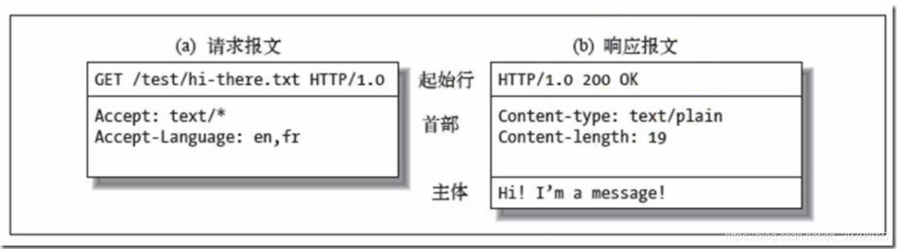
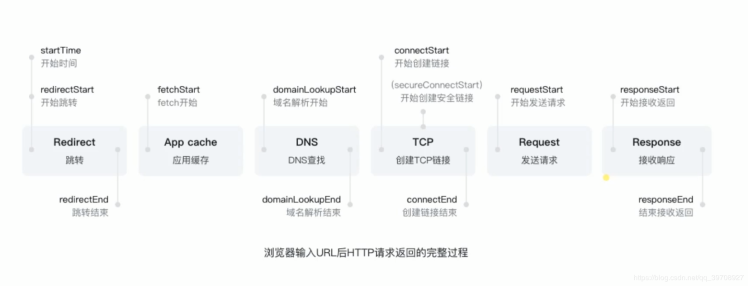
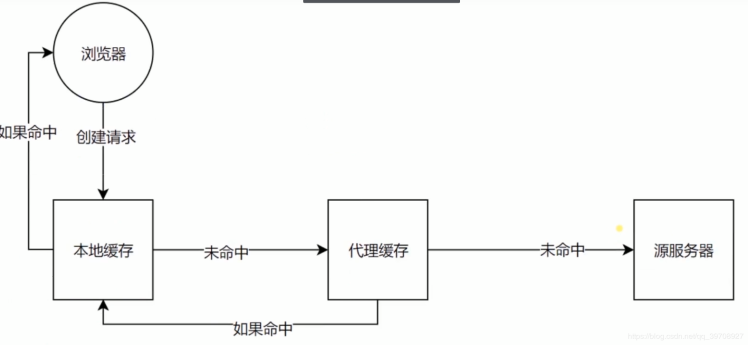
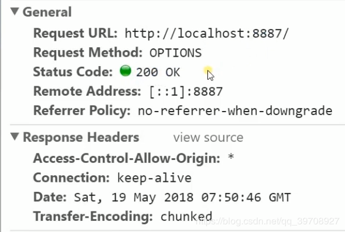

## 首先让我们来了解一下 http 的请求报文和响应报文

  

## 再向您献上一张 http 请求的流程图

  

## Redirect（资源重定向）的 HTTP 响应头部

> - Location:''（后面接跳转的 URI 路径）
> - 通过 response.write(302,{ Location:'/new' })返回的 xhr.status>=300&&xhr.status<400 才能进行重定向

## Cache-Contorl 的含义和使用的 HTTP 响应头部

> - 可缓存性： |**public**|http 经过的地方都能够进行缓存  | |**private**|只有发起请求的浏览器才能够进行缓存| |**no-cache**|本地可以缓存，但是需要在服务端验证过后才能使用|
> - 到期： |**max-age=<second>**| 浏览器缓存多长时间到期 | |**s-maxage=<second>**|代理服务器缓存的到期时间| |  **max-stale=<second>**| 在 max-age 到期之后，在 max-stale 期限之内还是可以取缓存 |
> - 重新验证：（使用较少） |**must-revalidate**|   在 max-age 过期之后必须到原服务端发起请求来验证此缓存是否过期了，而不能直接使用本地的缓存| |**proxy-revalidate**|使用在缓存服务器，在缓存过期之后到原服务端请求验证缓存是否过期了，而不能直接使用本地的缓存|
> - 其他： |**no-store**|本地和代理服务器都不能缓存，永远只能到服务端拿取新的内容才能使用| |**no-transform**|指定代理服务器不能修改服务端返回的内容|

> - 服务器缓存的验证更新机制： | **Last-Modified** （上一次修改时间）| 在服务端返回 Last-Modified，浏览器在下一次请求的时候会带上**If-Modified-Since** 与服务器的 Last-Modified 对比，如果相等，那么资源没有被修改过，服务器则告诉浏览器直接使用缓存| |**Etag**（数据签名：对静态资源进行 hash 计算的到唯一值的签名）|在服务器返回 Etag，浏览器在下一次请求的时候会带上**If-None-Match**与服务器的 Etag 进行对比，如果相等，那么资源没有被修改过，服务器告诉浏览器直接使用缓存|

## CORS 跨域请求的 HTTP 响应头部

  

> - **Access-Control-Allow-Origin**:支持跨域的 URI
> - **Access-Control-Allow-Headers**:跨域请求支持的请求头（由于 cors 跨域对请求头和请求方法存在限制，所以需要服务端来进行处理才能使用相应的请求头和请求方法）
> - **Access-Control-Allow-Methods**:跨域请求支持的请求方法（eg:'PUT,DELETE,POST'）
> - **Access-Control-Max-Age**:1000   意思是在 1000s 内的以上跨域（包括跨域支持的头部和请求方法）都不用发送 cors 预请求来验证，可以直接发送正式请求
> - **注意**：如果在 cors 跨域时，服务端不设定允许的请求头或者请求方法返回，浏览器虽然可以接收返回的信息，但是为了安全考虑，是不会显示内容的。
> - **注意**：由于浏览器会为了安全着想，在发送除了 PUT,HEAD,POST 方法，和 Content-Type 为 text-plian,multipart/form-data,application/x-www-form-urlencoded 类型以外的 cors 限制发送的请求时，会先在发送正式请求之前发送一个预请求（method 方法为 OPTION）来获取服务端允许的请求域，请求方法，请求头等信息。

## Cookie 的 HTTP 响应头部

> - 服务端通过在响应头中设置**set-Cookie**，设置 Cookie
> - 键值对，可以通过'[]'设置多个 cookie
> - 浏览器的下一次请求的时候会带上
> - 同域才能发送 cookie
> - cookie 的属性： |**max-age**和**expires**| 设置过期时间 | |**Secure**|只能通过 https 发送| |  **HttpOnly**|无法通过 document.cookie 或者其他脚本程序访问，防止 xrs 攻击  |

## Connection（TCP 连接）的 HTTP 响应头部

> - **HTTP1.1**一般只有 6 个 TCP 的并发链接,其他的连接会阻塞
> - **Connection:'close'**   没有长连接，在每一次请求完毕之后关闭 TCP 连接，有新请求时创建一个新的 TCP 连接
> - **Connection:'keep-alive'**   有长连接，在六个 TCP 连接中如果有一个连接完成数据传输，则将那个 TCP 连接给下一个请求用

## CSP（ Content-Security-Policy:）的 HTTP 响应头部

> 作用：
>
> 1. 限制网页资源的获取（从哪里获取，请求发到什么地方）
> 1. 限制报告资源获取越权（当获取到不应该获取的资源时候，给网页一些报告）

> 限制方式：
>
> - defalut-src:(限制全局) | http |   只能通过 http 进行加载| |http https|只能通过 http 或者 https 进行加载| | \'self\' | 只能通过本域名的进行加载 | |http.baidu.com|可以限定制定的网站进行加载|
> - 制定资源类型: 1.connet-src:请求发现的目标进行限制 2.img-src:图片可以从哪些网址加载 3.font-src:字体从哪里加载 4.script-src:脚本资源从哪里进行加载 ..................网页可以从外部加载的都可以进行资源的限制
> - .form-action   '\self':对 form 表单提交的 action 进行限制
> - report-uri  + 服务器的路径（可以向服务区提交加载错误的信息）
> - Content-Security-Policy-Report-Only:（虽然检测到资源不想加载，但还是可以加载） ................

## 数据协商：客户端和服务端协商声明所需要的数据类型（以下是 HTTP 请求头部）

> - Accept:浏览器能够处理的 MIME 类型
> - Accept-Charset:浏览器能够显示的字符编码
> - Accept-Encoding:浏览器能够处理的压缩编码
> - Accept-Language:浏览器当前设置的语言
> - Connection:浏览器与服务器之间连接的类型
> - Cookie:当前页面设置的任何 cookie
> - Host:发出请求页面所在的域
> - Referer:发出请求页面的 URI
> - User-Agent:浏览器的用户代理字符串

 延伸阅读： CSP 扩展：[CSP 内容安全策略](https://developer.mozilla.org/zh-CN/docs/Web/HTTP/CSP) HTTPS（图解 HTTPS，写的挺好的博客）：[HTPPS](https://blog.csdn.net/forezp/article/details/89666603) HTTP2：[HTTP2 网络质和量的提升](https://juejin.im/post/5b88a4f56fb9a01a0b31a67e)
