

#### 1. 热部署：升级 nginx 到新的版本

- 也就是用新的 nginx 命令替换老的 nginx 命令即可，注意做好备份
- kill -RSR2  pid(nginx 的进程号) :发送消息给老的 master 进程，让后面的接口平滑的过渡到新的 nginx 进程中
- kill -WINCH pid :请优雅的关闭老的 woker 进程
- 老的 master 进程会保留，可以重新 reload，保证可以版本回退

 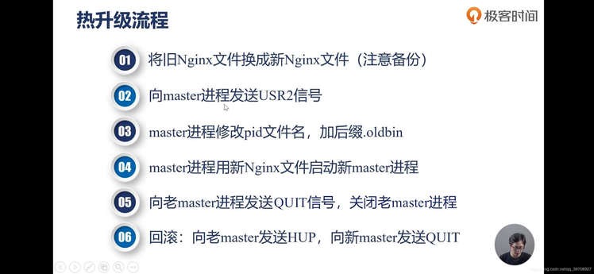 

#### 2. root 和 alias 的区别：

- root 会受 location 后面的字符串所影响，访问 location 路径会将 location 的路径添加到 root 后返回结合的路径资源给用户，
- 而 alias 是不受字符串的影响，访问 location 就是访问的 alias 路径的资源

#### 3. Nginx 的进程间是通过信号的方式进行通信

 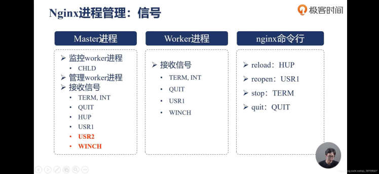 

#### 4.指令合并规则

 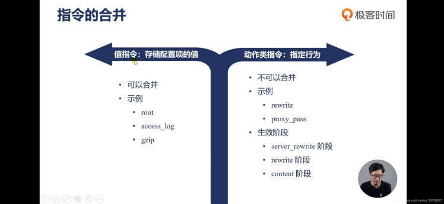 

#### 5.Nginx 11 个阶段：

- 除了 http 过滤模块和提供变量的模块外，其余模块必须经过这 11 个阶段
- 一个阶段如果不把请求向下传递，下面的阶段是不会执行的
- 前一个阶段的模块可以传递给他下下个阶段模块进行处理，那么下个阶段模块也就没法执行

> - post_read:在读取了 http 头部后，在加工头部前
> - server_rewrite:
> - find_config:进行 location 的匹配
> - post_rewrite:在 rewrite 之后
> - pre_access:在访问到请求之前做连接或者请求数量的限制
> - access:在访问时，比如说身份验证
> - post_access:
> - pre_content:发送响应之前执行的操作,比如让一个请求产生多个子请求
> - content:响应阶段，比如反向代理
> - log:日志记录阶段

  
 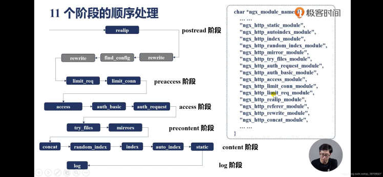 

##### post_read 阶段:

##### rewrite 阶段:

#### 1. error_page 和 rewrite 阶段的 return 指令的区别：

- return ：返回相应的状态码和注释
- error_page：根据相应的状态码返回相应的页面
- return 指令执行了 error_page 指令就不会执行 
  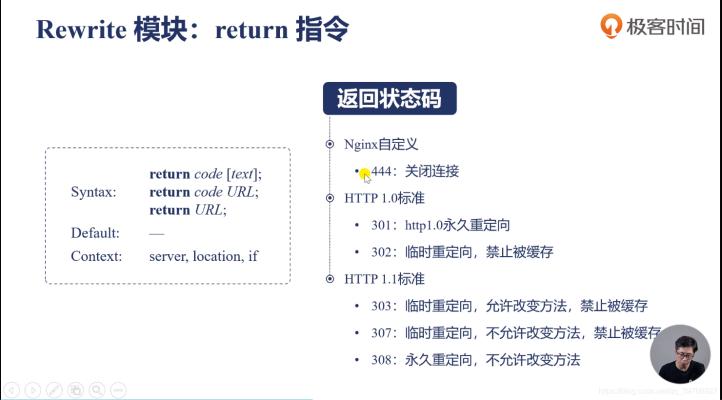
  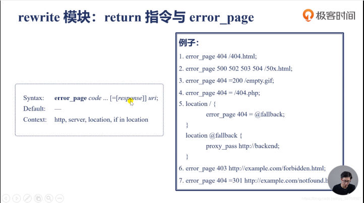

#### 2.if 语句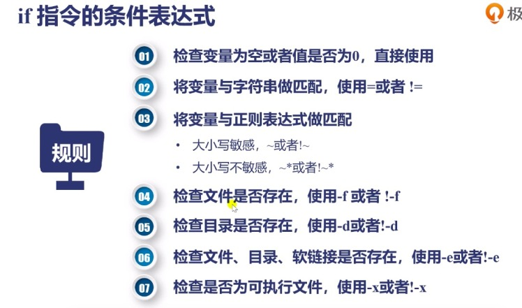

#### 反向代理和负载均衡：

 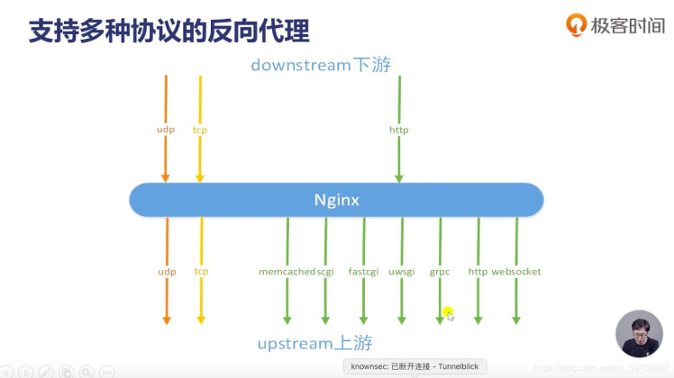 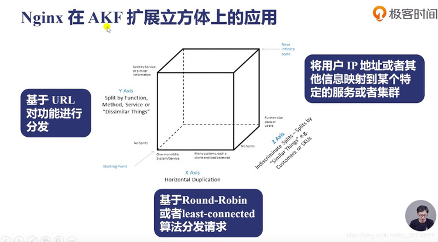 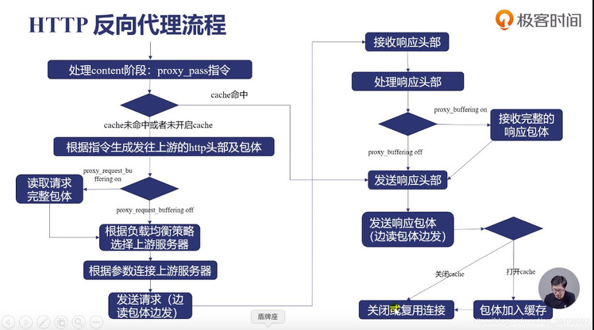 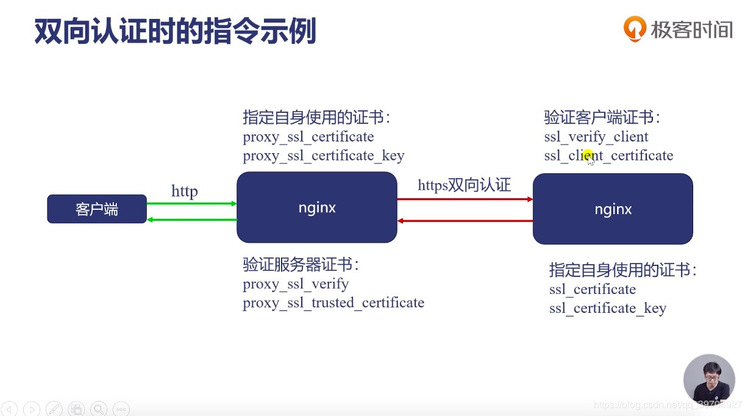
