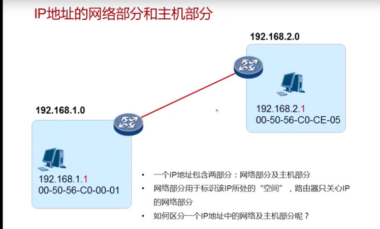
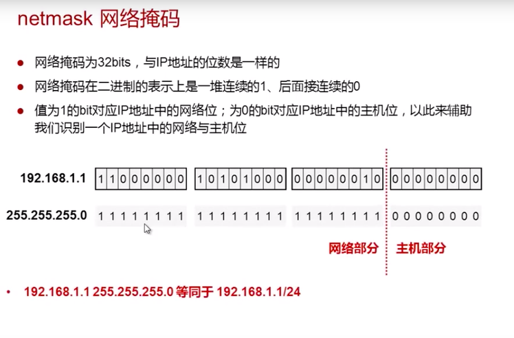
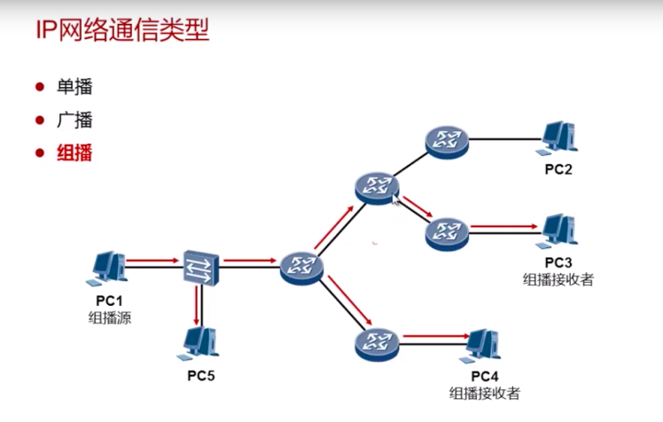
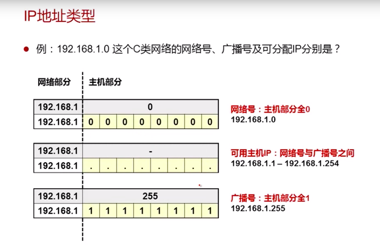
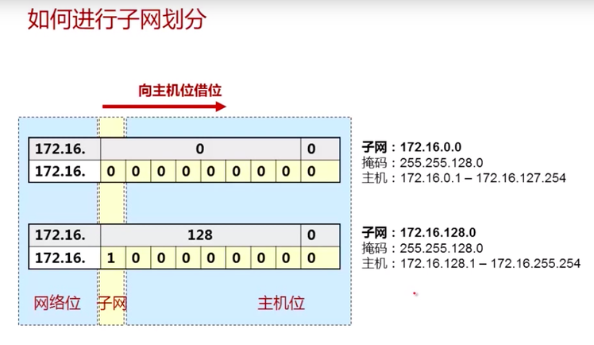
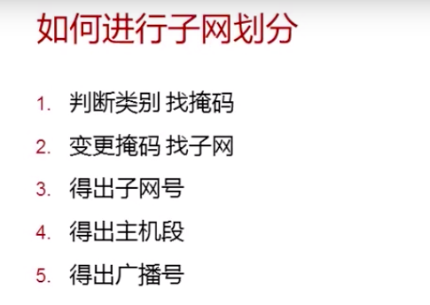
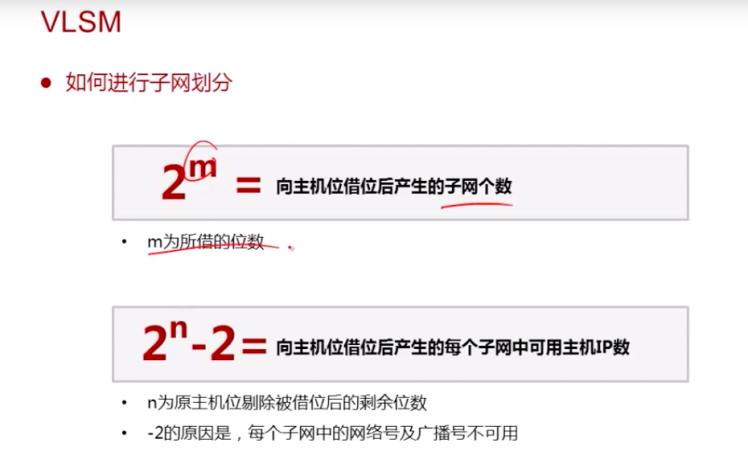
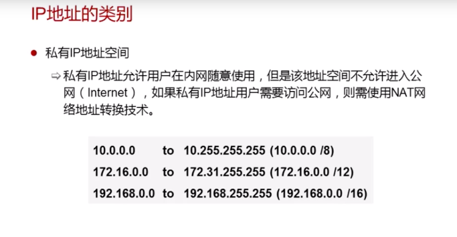

<a name="M4rZJ"></a>

#### 网络部分：划分子网

<a name="Nh8DI"></a>

#### 主机部分：可以分配给 pc 的 ip 地址

<br />

<a name="lNg98"></a>

#### 掩码的作用主要是划分子网：

<a name="E3IS8"></a>

```
例如：192.168.1.1 的子网掩码是：255.255.255.0

子网缺省表示：192.168.1.1/24(24 表示有 24 位网络位，如果划分了子网，该 c 类地址的网络位不为 24)
```

<br />



<a name="FN3Xs"></a>

```
单播：点对点通信，一个发送者，一个接收者。

<a name="Qr4R3"></a>

广播：路由器隔绝广播的传播。接收到的包的 mac 地址全是 f,ip 地址全是 1 的为广播通信。全网广播

<a name="aE4RA"></a>

组播：一个组播源，多个组播接受者，组播的包只会发送到组播接受者去。充分利用了带宽。iptv
```

<br />

<a name="M3wO9"></a>

#### IP 地址的类型：

<br />

<a name="4O3qn"></a>

#### 如何进行划分子网：向主机位借位

<br /><br /><br />

<a name="p36om"></a>

#### 私有 IP 地址：

<br />
