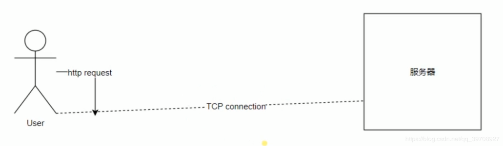

 

> 有图可知，由于 HTTP 只有请求和响应的概念，信道连接需要通过 TCP 来完成的，因此让我们先来谈谈 TCP 的三次握手和四次分手吧

  

1. 客户端首先要 SYN=1,表示要创建连接
1. 服务端接收到后，要告诉客户端：我接受到了！所以加个 ACK=1 表示确认跟客户端创建连接，因为 TCP 连接是双向的，然后还需要发送 SYN=1 表示我也想跟你连接
1. 理论上这时就创建连接成功（也就是半连接状态）了，但是要防止一个意外(也就是下面的为什么需要三次握手)，所以客户端要再发一个消息给服务端确认一下，这时只需要 ACK=1 就行了
1. 三次握手完成

> - SYN：代表请求创建连接，所以在三次握手中前两次要 SYN=1，表示这两次用于建立连接；
> - ACK：代表确认接受，不管是三次握手还是四次分手，在回应的时候都会加上 ACK=1，表示消息接收到了，并且在建立连接以后的发送数据时，都需加上 ACK=1,来表示数据接收成功；
> - seq：序列号，什么意思呢？当发送一个数据时，数据是被拆成多个数据包来发送，序列号就是对每个数据包进行编号，这样接受方才能对数据包进行再次拼接。初始序列号是随机生成的，这样不一样的数据拆包解包就不会连接错了。（例如：两个数据都被拆成 1，2，3 和一个数据是 1，2，3 一个是 101，102，103，很明显后者不会连接错误）
> - ack:这个代表下一个数据包的编号，这也就是为什么第二请求时，ack 是 seq+1，
> - 为什么需要三次握手？---------------如果一个连接请求在网络中跑的慢，超时了，这时客户端会重发请求，但是这个跑的慢的请求最后还是跑到了，然后服务端就接收了两个连接请求，然后全部回应就会创建两个连接，浪费资源！如果加了第三次客户端确认，服务端在接受到一个客户端连接确认请求后，后面再接收到的连接确认请求就可以抛弃不管了。 -------------- 还有一个原因是：因为 TCP 连接时双向的，所以不仅需要连接客户端和服务端的单向连接，还需要连接服务端和客户端的单向连接，在第二次服务端发送了 SYN=1 请求连接的时候还需要客户端发送 ACK=1 来确认连接才能成功双向连接。

  

1. 首先客户端请求关闭客户端到服务端方向的连接，这时客户端就要发送一个 FIN=1，表示要关闭一个方向的连接（见上面四次分手的图）
1. 服务端接收到后是需要确认一下的，所以返回了一个 ACK=1,现在处于半关闭状态，服务端还可以发送数据给客户端（关闭了客户端向服务端发送数据的信道，但 TCB 还未销毁，仍可发送 ACK）
1. 这时只关闭了 TCP 一个方向，另一个方向也需要关闭,如果服务端没有数据发送给客户端了，服务端也向客户端发了一个 FIN=1 ,ACK=1，当然也要有 seq 和 ack
1. 客户端接收到后发送 ACK=1，表示接受成功
1. 服务端接收到客户端发来的 ACK=1 后关闭 TCP 连接，销毁 TCB（什么是 TCB 见下）
1. 客户端等到 2MSL 后再销毁 TCB（什么是 2MSL 见下）
1. 四次分手完成！

> - FIN：表示请求关闭连接，在四次分手时，我们发现 FIN 发了两遍。这是因为 TCP 的连接是双向的，所以一次 FIN 只能关闭一个方向。
> - **注意**：TCB 传输控制块是客户端和服务端在请求连接和关闭连接时都会生成的，在请求连接成功和关闭连接成功时销毁，ACK，ack，FIN，seq 等通过 TCB 发送给对方。
> - 为什么客户端需要等到 2MSL 后才能关闭？---------------服务端在要分手的时候，如果由于某些网络原因没有收到客户端说的确认，那么它会再说一次分手，也就是重发 FIN，如果客户端在说完确认之后就关闭了 TCP 连接，那么服务端是不知道客户端到底能不能和它和平分手的，那么它的端口就一直不能关闭，所以需要客户端等待 2MSL 再关闭 TCP 连接。
> - 为什么需要四次分手？--------------TCP 是双向的，所以需要在两个方向分别关闭，每个方向的关闭又需要请求和确认，所以一共就 4 次。
> - 为什么服务端不一起发送 FIN 和 ACK 呢？这样才三次握手-----------------------在客户端说了分手之后，它还是可以接受数据的，只是不能发送而已，如果只有三次握手，服务端在没有发完数据的情况下就关闭了 TCP，那么客户端得到的数据是不完整的，所以服务端需要在客户端请求关闭连接的时候第一次就发送 ACK 说我收到了，但是你再等等，我还有数据没有发完给你，等发完之后，才发送 FIN 关闭 TCP 连接。

 此文章参考链接：[TCP 的三次握手和四次分手](https://baijiahao.baidu.com/s?id=1593714120815701015&wfr=spider&for=pc) 2MSL 解释：[2MSL 是什么？](https://blog.csdn.net/zxx2096/article/details/80286577)
