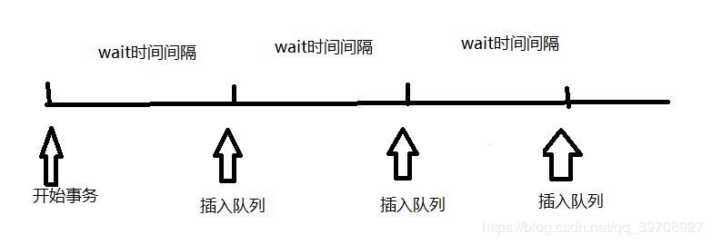
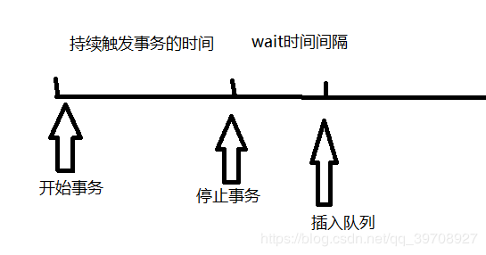
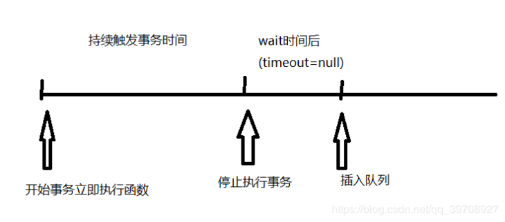

<a name="29e7c796"></a>

#### --连续尝试进行过多的 DOM 相关操作时，这很可能会导致浏览器挂起，有时候甚至崩溃

<a name="1776e45a"></a>

#### --此时，就需要节流和防抖来使某些代码不可以在没有间断的情况下连续重复的执行。

> **节流**：让事务在一段时间间隔内周期性的执行（举个栗子：就好像不让水龙头一直不停的流，而是把水龙头揪紧一丢丢，让它一滴一滴周期性的流下去，以此达到节流的效果）
> 

```
function throttle(func,wait){
    let timeoutID;                                //初始化定时器
    return function(){                            //调用throttle则返回此闭包
        let args=arguments;                       //保存传给闭包的参数(比如：event对象)
        let context=this;                         //保存闭包的执行环境
        if(!timeoutID){                             //如果定时器不存在
            timeoutID=setTimeout(function(){        //则创建一个新的定时器
                func.apply(context,args);            //绑定func的执行环境为调用闭包的this环境，传入func的参数为调用闭包的参数
                timeoutID=null;                     //执行完func重置timeout
            },wait);                             //在wait时间后将匿名函数插入执行队列
        }
    };
}
1.函数的目的是：定义一个定时器，如果定时器不存在，则创建一个新的定时器，并执行函数func；
2.函数返回闭包的原因：为了保持timeoutID变量一直在内存中,调用throttle函数返回的都是**执行过后**的闭包函数来访问timeoutID,通过timeoutID来判断调用throttle时是否存在定时器;
3.注意：apply和call不仅会绑定函数的执行环境和传入参数，还会立即执行函数
```

> **持续防抖**：如果持续触发事务，则不执行，在停止持续触发事务一段时间后，再执行事务（举个栗子：坐电梯时，如果在电梯内持续有人按电梯的楼层号，那么电梯是不会启运行的，当没人按楼层号时，电梯会在一小段时间间隔之后才会运行.以此达到持续防抖的效果）
> 

```
function debounce(func,wait){
    let timeoutID;
    return function(){
        let context=this;
        let args=arguments;
        if(timeoutID!==null)clearTimeout(timeoutID);         //如果存在定时器，则将清除定时器
        timeoutID=setTimeout(function(){            //再次创建新的定时器
            func.apply(context,args);
        },wait);
    };
}
```

> **立即防抖**：让事务开始触发时立即执行，然后持续触发事务时不执行，当停止触发事务一段时间后再将事务插入任务队列。（再举个栗子：一直按住弹簧，它不会弹起来，如果突然松手之后，它就会立刻弹起，如果在弹起的过程中又持续按住了弹簧，又突然松手，它就会在一段微小的时间间隔之内再次弹起。以此达到立即防抖的效果。）
> 

```
function debounce(func,wait){
    let timeoutID;
    return function(){
        let context=this;
        let args=arguments;
        if(timeoutID!==null)clearTimeout(timeoutID);          //如果存在定时器，则清除定时器

        timeoutID=setTimeout(function(){
            timeoutID=null;                                       //定时器在wait时间后清零
        },wait)

        if(timeoutID===null) {                              //如果不存在定时器(timeout=null)，则执行函数
            func.apply(context,args);
        }
    };
}
```

> 因此个人认为，防抖和节流的共同作用都是让浏览器节约成本的操作，区别是实现和节约成本的方式不同。

<br />参考博客：[附上一个写的很好的博客](http://blog.poetries.top/2018/12/21/js-debounce/#at?hmsr=toutiao.io&utm_medium=toutiao.io&utm_source=toutiao.io)
